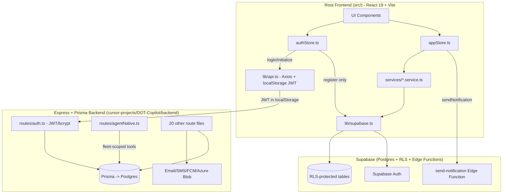

# DOT-Copilot Codebase Map

Generated as part of an architecture review. Reflects repo state as of 2026-07-06.
Business context: pilot customer is Baldor Specialty Foods (current frontend branding);
the platform itself is a Dobeu Tech Solutions product intended for future white-label
multi-tenant resale.

## 1. Directory Purpose Table

| Path | Purpose | Status |
|---|---|---|
| `src/` | Root React 19 + Vite + Supabase frontend. **Primary/active app.** | Live |
| `src/store/` | Zustand stores: `authStore.ts` (auth), `appStore.ts` (all domain data), `toastStore.ts` (UI toasts) | Live |
| `src/lib/supabase.ts` | Supabase JS client singleton | Live |
| `src/lib/api.ts` | Axios-style wrapper calling the Express backend (`/api/auth/login`, `/users/me`) with localStorage JWT | Live (transitional — see Finding below) |
| `src/services/*.service.ts` | Per-domain Supabase query modules (vehicles, training, compliance, profiles, notifications, modules) | Live |
| `src/types/database.ts` | Hand-written domain types (Profile, Fleet, TrainingProgram, Assignment, etc.) | Live |
| `supabase/migrations/` | Postgres schema + RLS migrations (9 files, latest `20260410_add_btw_sessions_and_webhooks.sql`) | Live |
| `supabase/functions/send-notification` | Supabase Edge Function | Live |
| `cursor-projects/DOT-Copilot/backend/` | Express 4 + Prisma 7 API. 22 route files, 25+ Prisma models, JWT auth, Redis, Twilio/FCM/Azure Blob | Live (dual-stack, being narrowed to BFF per ADR-0006) |
| `cursor-projects/DOT-Copilot/backend/src/routes/agentNative.ts` | Agent-native tool-call API (`GET /tools`, `POST /invoke`) for LLM orchestrators — atomic, fleet-scoped tools | Live, backend-only |
| `cursor-projects/DOT-Copilot/frontend/` | Legacy React + Axios frontend calling the Express API directly | Legacy — marked for archive per ADR-0006 |
| `cursor-projects/DOT-Copilot/infrastructure/azure/` | Bicep IaC for Azure App Service + Static Web Apps | Legacy target (superseded by Vercel decision, see Part B) |
| `cursor-projects/DOT-Copilot/docs/adr/` | Canonical ADRs — source of truth for stack decisions | Live |
| `cursor-projects/DOT-Copilot/vercel.json` | Vercel build config wiring inner `frontend/` + inner `backend/` as a Node function | Stale/orphaned — targets the **inner** stack, not root `src/` |
| `docker/` | FastAPI + MCP gateway + Auth0-oriented compose stack | Non-canonical / experimental, explicitly disclaimed in `docker/DEPRECATED-STACK.md` |
| `_archive/legacy-stack/` | Auth0 + MongoDB + FastAPI prototype (Python scripts, `docker-api/`) | Dead code, correctly archived |
| `database/` | Docs on Supabase connection setup, migration contracts, pricing | Live (documentation only) |
| `docs/` (root) | `migration-plan.md`, `code-tour.md`, compliance backlog, game-day scenarios | Live |
| `ARCHITECTURE_EVALUATION_AND_GAMEPLAN.md` (root) | Generic AI-generated audit (references Auth0/MongoDB/FastAPI) — **does not match current stack**, superseded by inner ADRs | Stale, should be deprecated or deleted |
| `scripts/` | Bash scripts for Postgres/MongoDB backup/restore, Bicep validation | Live (partially legacy — MongoDB scripts orphaned) |

## 2. Module Responsibilities

- **Auth**: Two paths coexist today. `authStore.login()`/`initialize()` call the Express `/api/auth/login` + `/users/me` with tokens persisted via `localStorage` (`src/lib/api.ts`). `authStore.register()` calls `supabase.auth.signUp()` directly. This is a **mid-migration hybrid**, not the clean Option A state ADR-0006 describes yet.
- **Domain data (drivers, fleets, training, compliance, vehicles, notifications)**: `appStore.ts` + `src/services/*.service.ts` query Supabase directly, protected by RLS. This part of ADR-0006 Option A is implemented.
- **Server-side-only concerns** (email/SMS, webhooks, Azure Blob, BTW dual-signature, agent-native tool API): live exclusively in the Express backend (`cursor-projects/DOT-Copilot/backend/src/routes/`) — appropriate BFF scope per ADR-0006.
- **Compliance/DOT tracking**: Supabase tables + RLS (root) and Prisma models (inner) — schema drift flagged in ADR-0008; Prisma currently has more models (25+) than Supabase (~15 tables, per ADR-0008 note).

## 3. Data Flow (Mermaid)

## 4. Live vs Legacy/Archive Summary

**Live / production-relevant:**
- Root `src/` Supabase frontend (primary UI)
- `supabase/migrations/`, `supabase/functions/`
- Inner `backend/` Express + Prisma (BFF-in-progress: auth, webhooks, notifications, BTW, agent-native API)

**Legacy / to retire:**
- Inner `frontend/` (Axios client) — ADR-0006 marks for archive
- `cursor-projects/DOT-Copilot/infrastructure/azure/` Bicep — superseded once Vercel is confirmed as prod target
- `_archive/legacy-stack/` — already archived (Auth0 + MongoDB + FastAPI prototype)
- `docker/` FastAPI/MCP-gateway compose stack — explicitly disclaimed, keep only if productizing MCP gateway

**Stale documentation (misleading, should be flagged/removed):**
- Root `ARCHITECTURE_EVALUATION_AND_GAMEPLAN.md` — describes a different stack (Auth0, MongoDB, FastAPI) that does not match this repo; likely leftover from the `_archive/legacy-stack` prototype phase. The **actual** canonical decisions live in `cursor-projects/DOT-Copilot/docs/adr/0005–0008`.
- `cursor-projects/DOT-Copilot/vercel.json` — configured for the inner `frontend/`+`backend/`, not the root Supabase app; will misroute if used as-is for a root-app Vercel deployment.

## 5. Navigation Guide

- Start with `CLAUDE.md` (root) for the monorepo overview.
- For **current architecture direction**, read `cursor-projects/DOT-Copilot/docs/adr/0006-canonical-application-stack-decision.md` (accepted direction, supersedes 0005) plus 0007 (token storage) and 0008 (schema sync) — these are the real source of truth, not the root `ARCHITECTURE_EVALUATION_AND_GAMEPLAN.md`.
- For **frontend data flow**: `src/store/appStore.ts` → `src/services/*.service.ts` → `src/lib/supabase.ts`.
- For **auth**: `src/store/authStore.ts` (note the hybrid Express/Supabase behavior) and `src/lib/api.ts`.
- For **backend BFF routes**: `cursor-projects/DOT-Copilot/backend/src/routes/`, especially `agentNative.ts` for agent/Composio-facing endpoints.
- For **schema**: `supabase/migrations/*.sql` (RLS source of truth per ADR-0006) vs `cursor-projects/DOT-Copilot/backend/prisma/schema.prisma` (legacy/interim source of truth per ADR-0008, pending retirement).
- For **deploy config**: `cursor-projects/DOT-Copilot/vercel.json` (inner stack, needs rework or replacement) and `cursor-projects/DOT-Copilot/infrastructure/azure/*.bicep` (legacy Azure IaC).
